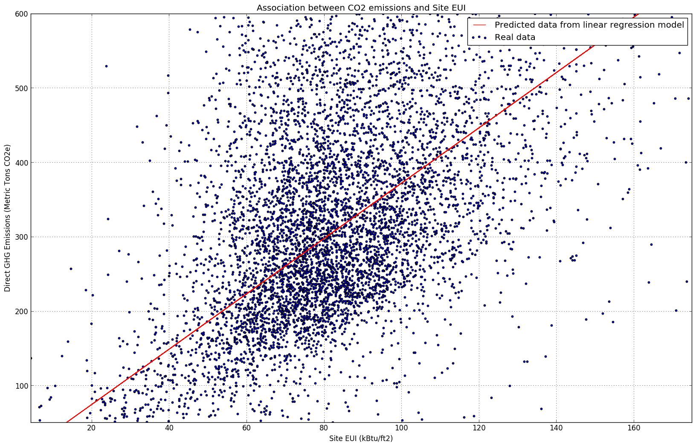

#  Review for zz1749
### Reviewed by: ep2247

**Review:**
    The plot is clear and easy to read.  The color makes sense for what is being conveyed.  When testing for color blindness using color oracle, the Deuteranopis and Protanopia, the dots and the predicted line are almost the same color but you can still tell them apart.  One suggestion would be to add an alpha to make the dots a little bit more transpartent so you can see more of the red line.  The legend is good at telling what the graph shows.  The figure is good at saying what the plot is about, however a suggestin would be to add a caption to explain what is going on in the plot more.
