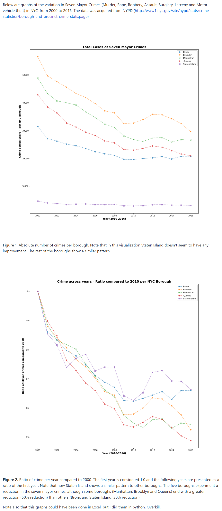

Review by Zhiao Zhou (zz1749)

**CLARITY**  
Both figure one and figure two are easy to read as they clearly show people trends of the absolute numbers of crimes and the ratio of that number over the number of year 2010 per year by borough with scatter points and lines. However, I think a translucent grid would be better added in both of them as now people could find it hard to see the absolute value of each point. In addition, in Figure one, as the scale is very big from 0 to 60000 in a short axis, some small changes would be hardly noticed though this is solved in figure 2.
 
**AESTHETHIC**  
The colors are chosen appropiately in both two figures which allow me to focus on the right elements and the labels, title and legends are placed and set beautifully. And by the way, I don't treat color blindness as a problem here since there are so many different kinds of color blindness which all bring to respective difficulty recognizing certain kinds of colors and in order for this, there are already certain softwares or mobile applications that help people with them. 

**HONESTY**  
Figure one and figure two show people the trend of how numbers of crimes was being declined over years by borough. However, there is a problem that people could easily compare these numbers and say some boroughs are more dangerous than the others. This is not true since a area with bigger population would tend to have more crimes. So here I would suggest use crime rates instead of absolute numbers of crimes which would reduce the impact of population.