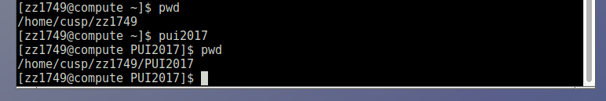
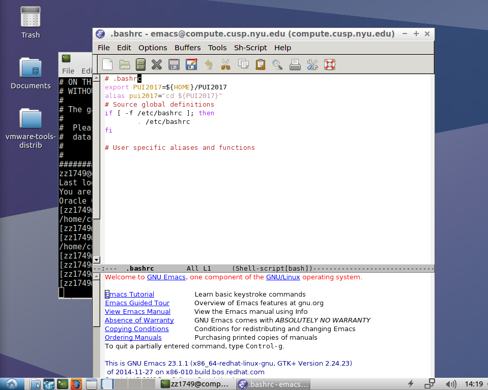

# PUI2017_zz1749

### HOW I SET UP MY ENVIRONMENT
- Created a directory on my workspace on CUSP compute called PUI2017
- Created an env.variable PUI2017 that points to that directory using export so that typing echo $PUI2017 would return to the full path to that directory
- Created an alias using cd $PUI2017 so that typing pui2017 would take me to that directory 
- Save them in my .bashrc so that every time I open a new terminal it will run them defaultly (screenshot below)

